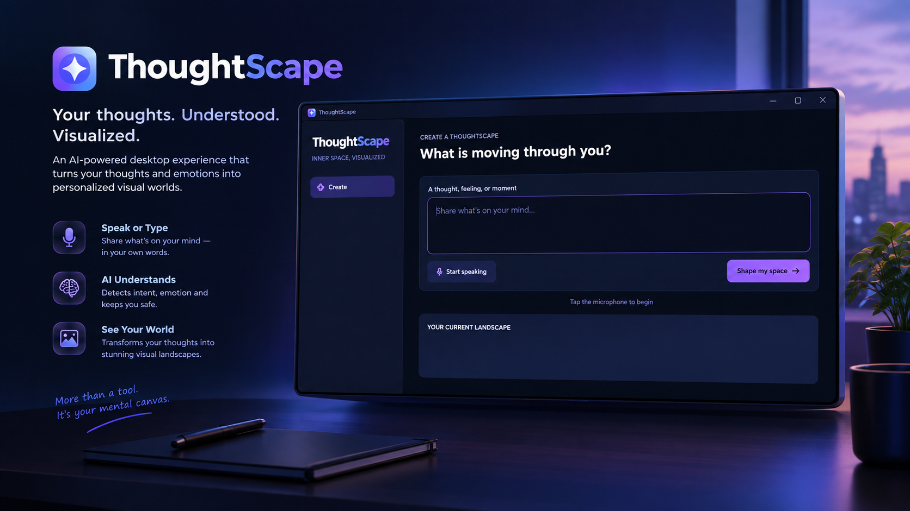

# 🌌 ThoughtScape

> **Your thoughts. Your emotions. Your world.**

**ThoughtScape** is an AI-powered Windows desktop application that transforms natural thoughts, emotions, and everyday moments into personalized visual worlds for your desktop.

Instead of asking users to write complex image-generation prompts, ThoughtScape allows them to simply **speak or express what is on their mind**.

The system understands the thought, interprets its emotional and visual context, creates a visual direction, generates a personalized image, and transforms the desktop experience.

---

## 🖥️ ThoughtScape in Action



## 💡 The Idea

Imagine saying:

> **"I joined a new team and everything feels overwhelming."**

Normally, an image generator would require you to describe exactly what you want:

- the scene
- colors
- lighting
- composition
- art style
- atmosphere

ThoughtScape approaches this differently.

You provide the **thought**.

The AI determines how that thought can become a visual experience.

```text
Thought
   ↓
Understanding
   ↓
Emotional & Visual Context
   ↓
Visual Direction
   ↓
Generated World
   ↓
Your Desktop
```

The goal of ThoughtScape is not simply to generate another wallpaper.

It explores how AI can turn human context into a meaningful and personalized desktop experience.

---

## ✨ Features

### 🎙️ Natural Thought Capture

Express what's on your mind naturally through speech instead of writing complicated image prompts.

Azure AI Speech converts spoken thoughts into text for further processing.

### 🧠 Intent Understanding

ThoughtScape determines what kind of input the user has provided.

The AI can distinguish between:

- Emotional thoughts
- Situational thoughts
- Direct visual requests
- Unsupported or off-topic requests

### ❤️ Feeling & Visual Interpretation

The application analyzes the thought and converts it into structured visual information such as:

- Mood
- Emotion
- Theme
- Intensity
- Visual elements
- Wallpaper type
- Visual style
- Lighting

### 🎨 Intelligent Prompt Generation

ThoughtScape automatically converts the interpreted context into a detailed image-generation prompt.

The user doesn't need to understand prompt engineering.

### 🖼️ Personalized Visual Worlds

The generated prompt can be used by an AI image model to create a visual world representing the user's thought and context.

### 🖥️ Windows Desktop Experience

The generated visual can become part of the Windows desktop experience by being applied as the desktop wallpaper.

---

## 🔄 How ThoughtScape Works

```text
┌───────────────────────────────┐
│             USER              │
│                               │
│      Thought / Emotion        │
└───────────────┬───────────────┘
                │
                ▼
┌───────────────────────────────┐
│       ThoughtScape UI         │
│           PySide6             │
└───────────────┬───────────────┘
                │
                ▼
┌───────────────────────────────┐
│        Azure AI Speech        │
│        Speech-to-Text         │
└───────────────┬───────────────┘
                │
                ▼
┌───────────────────────────────┐
│         Intent Router         │
└───────────────┬───────────────┘
                │
       ┌────────┴─────────┐
       │                  │
       ▼                  ▼
 Emotional /          Direct Image
 Situational             Request
       │                  │
       ▼                  │
┌───────────────────┐     │
│ Feeling & Visual  │     │
│    Interpreter    │     │
└─────────┬─────────┘     │
          │               │
          └───────┬───────┘
                  │
                  ▼
┌───────────────────────────────┐
│        Prompt Builder         │
└───────────────┬───────────────┘
                │
                ▼
┌───────────────────────────────┐
│       Image Generation        │
└───────────────┬───────────────┘
                │
                ▼
┌───────────────────────────────┐
│       Wallpaper Service       │
└───────────────┬───────────────┘
                │
                ▼
┌───────────────────────────────┐
│        Windows Desktop        │
└───────────────────────────────┘
```

---

## 🧠 AI Workflow

ThoughtScape separates **AI reasoning** from normal application services.

The reasoning workflow is orchestrated using **LangGraph**.

### 1️⃣ Intent Router

The first agent determines the type of user input.

```text
emotional
situational
direct_image
off_topic
```

For example:

```text
"I feel nervous about starting my new job."

→ emotional
```

```text
"I joined a new team and don't know where to begin."

→ situational
```

```text
"Create a peaceful mountain landscape."

→ direct_image
```

---

### 2️⃣ Feeling & Visual Interpreter

For emotional and situational inputs, ThoughtScape converts the thought into structured visual context.

Example:

```json
{
  "mood": "hopeful",
  "emotion": "uncertainty",
  "theme": "new beginning",
  "intensity": "medium",
  "visual_elements": [
    "path toward sunrise",
    "open landscape",
    "soft clouds"
  ],
  "wallpaper_type": "inspirational landscape",
  "visual_style": "cinematic",
  "lighting": "warm morning light"
}
```

This creates a bridge between **human language** and **visual language**.

---

### 3️⃣ Prompt Builder

The Prompt Builder converts the structured visual interpretation into a detailed prompt suitable for an image-generation model.

It can define:

```text
Subject
Environment
Composition
Mood
Lighting
Colors
Atmosphere
Visual Style
Cinematic Details
```

The resulting prompt is then passed to the image-generation service.

---

## 🏗️ Architecture

```text
                         ThoughtScape
                              │
          ┌───────────────────┴───────────────────┐
          │                                       │
          ▼                                       ▼
   Desktop Application                       AI Services
       PySide6                                     │
          │                                        │
          │                               Azure AI Speech
          │                                        │
          │                                  Speech-to-Text
          │                                        │
          └──────────────────┬─────────────────────┘
                             │
                             ▼
                      LangGraph Workflow
                             │
              ┌──────────────┼──────────────┐
              │              │              │
              ▼              ▼              ▼
            Router        Feeling         Prompt
                         Interpreter      Builder
                             │
                             ▼
                      Image Generation
                             │
                             ▼
                      Wallpaper Service
                             │
                             ▼
                         Windows OS
```

---

## 🛠️ Technology Stack

| Component | Technology |
|---|---|
| Programming Language | Python |
| Desktop Framework | PySide6 / Qt |
| AI Workflow | LangGraph |
| LLM Integration | LangChain |
| Speech Recognition | Azure AI Speech |
| Reasoning | Azure-hosted language model |
| Image Generation | Azure-hosted image model |
| Environment Configuration | python-dotenv |
| Target Platform | Windows |

---

## 📁 Project Structure

```text
ThoughtScape/
│
├── app.py
├── state.py
│
├── agents/
│   ├── router.py
│   ├── feeling_interpreter.py
│   └── prompt_builder.py
│
├── config/
│   └── llm.py
│
├── service/
│   ├── speechtotext.py
│   ├── image_generation.py
│   └── wallpaper.py
│
├── workers/
│   └── speech_signals.py
│
├── ui/
│   ├── main_page.py
│   ├── style_loader.py
│   │
│   ├── components/
│   │   ├── header.py
│   │   ├── input_card.py
│   │   └── landscape_card.py
│   │
│   └── styles/
│       └── main.qss
│
├── tests/
│
├── docs/
│   └── assets/
│
├── .env.example
├── .gitignore
├── requirements.txt
├── LICENSE
└── README.md
```

The project structure may evolve as ThoughtScape continues to develop.

---

# 🚀 Getting Started

## Prerequisites

Before running ThoughtScape, make sure you have:

- Windows 10 or Windows 11
- Python 3.x
- Git
- Azure AI Speech resource
- Required AI model access

---

## 1. Clone the Repository

```bash
git clone git@github.com:faizan8210/thoughtscape.git
cd thoughtscape
```

---

## 2. Create a Virtual Environment

```bash
python -m venv .venv
```

Activate it on Windows:

```powershell
.venv\Scripts\activate
```

---

## 3. Install Dependencies

```bash
pip install -r requirements.txt
```

---

## 🔐 Environment Configuration

ThoughtScape uses environment variables for credentials and service configuration.

Create a:

```text
.env
```

file in the root directory.

You can use `.env.example` as a template.

Example:

```env
AZURE_SPEECH_KEY=
AZURE_SPEECH_REGION=

# Add additional Azure/model configuration here.
```

> ⚠️ **Never commit `.env`, API keys, tokens, passwords, or Azure credentials to Git.**

Make sure `.env` is included in `.gitignore`.

---

## ▶️ Run ThoughtScape

After installing the dependencies and configuring the required environment variables:

```bash
python app.py
```

The ThoughtScape desktop application should launch.

---

# 🌿 Development Workflow

ThoughtScape currently uses a simple Git workflow.

```text
feature
   │
   │ Pull Request
   ▼
 main
```

### `main`

Contains the stable version of ThoughtScape.


ThoughtScape is under active development.

Contributions, bug reports, ideas, documentation improvements, and feature proposals are welcome.

A typical contribution workflow is:

1. Fork the repository.
2. Create a branch for your change.
3. Make your changes.
4. Add or update tests where appropriate.
5. Test the application.
6. Commit your changes with a descriptive message.
7. Push your branch.
8. Open a Pull Request.

For detailed contribution guidelines, see `CONTRIBUTING.md`.

---

# 📄 License

This project is distributed under the terms described in the `LICENSE` file.

---

# 🚧 Project Status

> **ThoughtScape is currently under active development.**

APIs, architecture, UI components, models, and functionality may change as the project evolves.

---

# 🌌 ThoughtScape

### **Your thoughts. Your emotions. Your world.**

**From a thought to understanding.  
From understanding to visual direction.  
From visual direction to your world.**